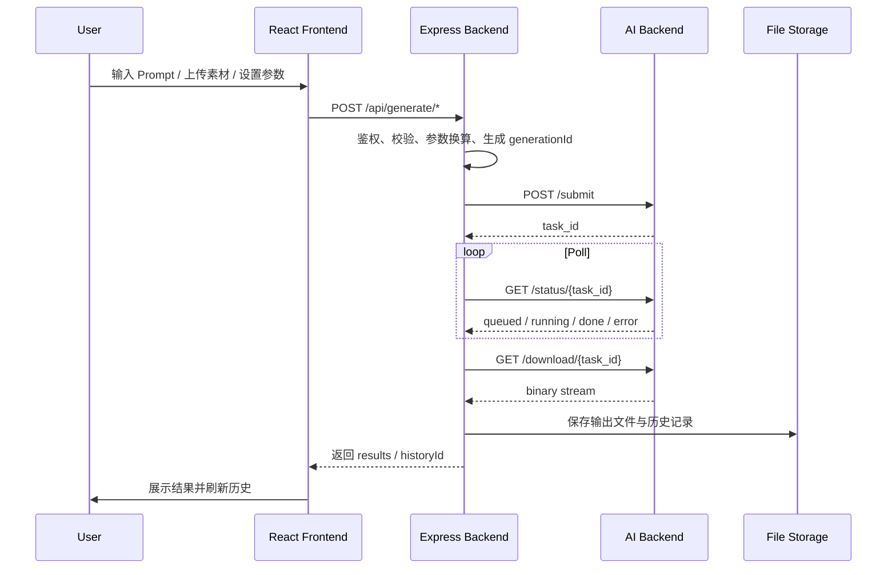
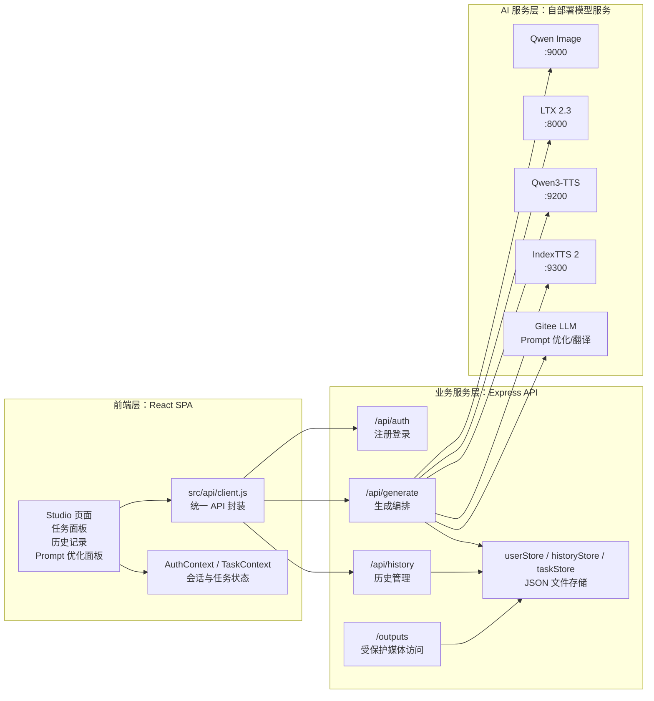
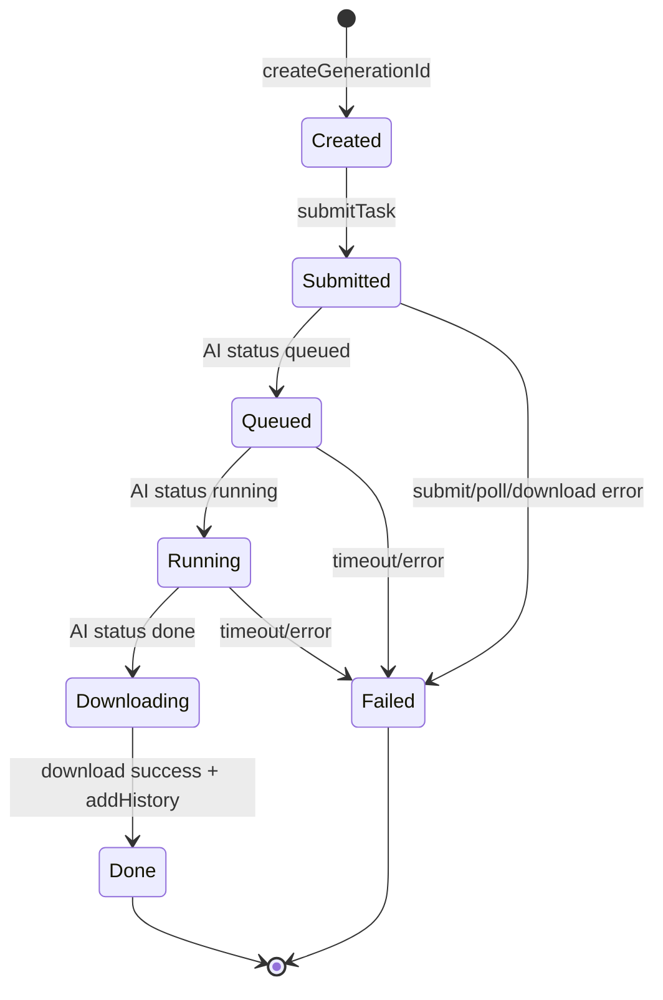
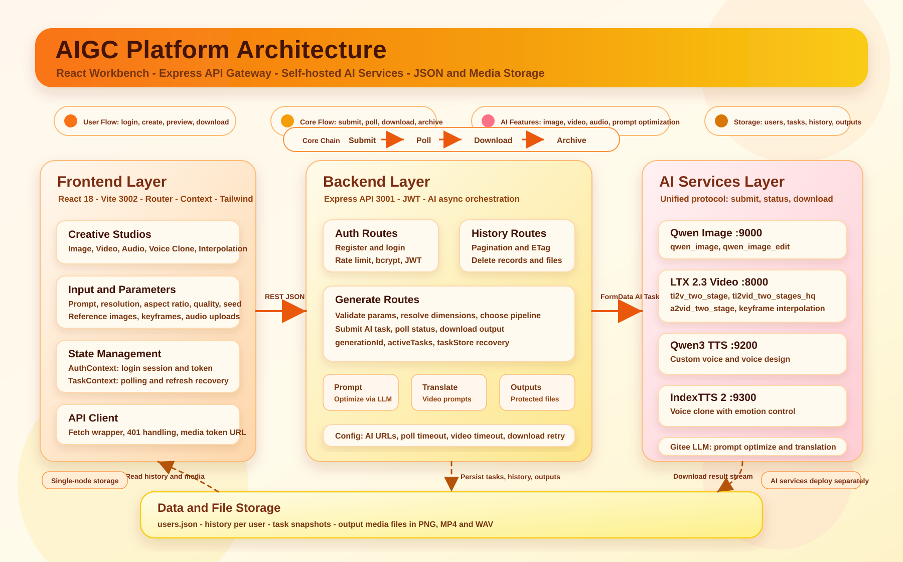
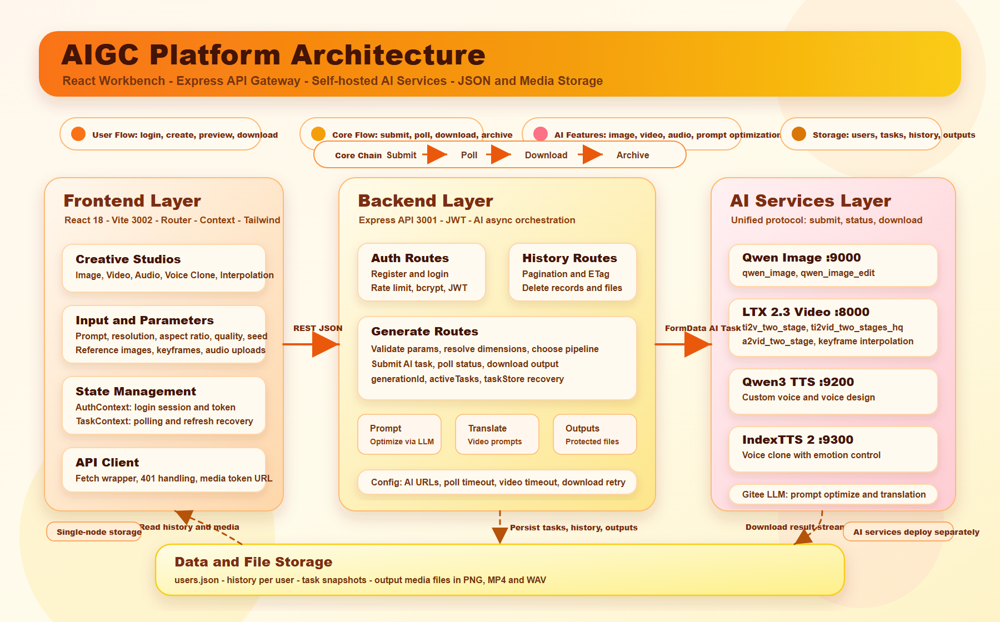

# AIGC 多模态创作平台技术说明文档

> 本文档面向研发、测试、部署运维以及新成员交接，系统说明 AIGC Platform 的业务能力、技术架构、核心流程、API 设计、数据存储、安全机制与部署配置。

## 0. 文档说明

### 0.1 文档目标

本文档用于完整描述 `aigc-platform` 项目的当前实现状态，帮助读者快速理解：

- 平台解决什么问题，支持哪些 AIGC 能力；
- 前端、后端、自部署 AI 服务之间如何协同；
- 各类生成任务如何提交、轮询、下载、入库和恢复；
- 认证、权限、文件隔离、限流等安全策略如何设计；
- 本地开发、生产部署和环境变量如何配置；
- 当前系统有哪些已知限制和后续优化方向。

### 0.2 读者对象

| 角色 | 关注重点 |
| --- | --- |
| 产品/项目负责人 | 平台能力边界、功能矩阵、业务流程、演示路径 |
| 前端工程师 | 页面路由、Studio 组件、任务面板、历史记录、鉴权状态 |
| 后端工程师 | API 路由、AI 后端协议、任务追踪、存储、错误处理 |
| 测试工程师 | 功能覆盖、接口输入输出、任务状态机、异常场景 |
| 运维/部署人员 | 环境变量、端口、AI 服务地址、超时调优、数据目录 |
| 新成员 | 项目结构、技术栈、模块边界、开发启动方式 |

### 0.3 术语表

| 术语 | 含义 |
| --- | --- |
| Studio | 前端具体创作工作台，例如图片工作室、视频工作室、语音工作室 |
| Generation | 一次用户发起的生成请求，在平台侧由 `generationId` 标识 |
| Task | AI 后端返回的异步任务，通常由 `task_id` 标识 |
| Pipeline | AI 后端的具体推理管线名称，例如 `qwen_image`、`ti2vid_two_stages_hq` |
| Polling | 平台后端定期请求 AI 后端 `/status/{taskId}` 获取状态的过程 |
| History | 生成成功后写入的历史记录，供用户在历史页查看、预览、下载和复用 |
| Output | 平台保存的生成结果文件，位于 `server/data/outputs/{username}/` |

### 0.4 当前实现依据

本文档以当前代码为准，重点参考：

- `package.json`
- `vite.config.js`
- `server/config.js`
- `server/index.js`
- `server/routes/auth.js`
- `server/routes/generate.js`
- `server/routes/history.js`
- `server/services/*`
- `server/utils/*`
- `src/App.jsx`
- `src/api/client.js`
- `src/contexts/TaskContext.jsx`

需要注意：`README.md` 中存在部分历史遗留说明，已经不能完全代表当前系统。当前架构应以 `server/config.js`、`server/routes/generate.js`、`CHANGES.md` 以及本文档为准。

## 1. 项目概述

### 1.1 平台定位

AIGC Platform 是一个面向多模态内容生成的统一创作工作台。它将多个自部署 AI 服务封装到统一 Web 平台中，为用户提供图像、视频、音频和语音克隆等能力。

平台当前对接的核心 AI 能力包括：

- Qwen Image：文生图、图片编辑；
- LTX 2.3：文生视频、图生视频、音频驱动视频、关键帧插帧；
- Qwen3-TTS：文本转语音、自定义音色、音色设计；
- IndexTTS 2：参考音频驱动的语音克隆；
- Gitee LLM：Prompt 优化与中文视频 Prompt 翻译。

### 1.2 核心业务价值

平台的核心价值不是单一模型调用，而是把分散的 AI 能力整合为可使用、可追踪、可恢复、可管理的创作流程：

- 用户无需直接接触多个 AI 服务端口和参数协议；
- 前端提供统一 Studio 交互，降低生成参数配置成本；
- 后端负责鉴权、参数校验、分辨率换算、任务轮询、结果下载和历史归档；
- 任务状态可在右侧面板持续追踪，页面刷新后仍可进行一定程度恢复；
- 所有结果按用户隔离存储，并通过受保护的 `/outputs` 路由访问。

### 1.3 能力矩阵

| 功能 | 前端入口 | 后端接口 | AI 服务 | 结果类型 |
| --- | --- | --- | --- | --- |
| 文生图 | `/dashboard/image` | `POST /api/generate/image` | `AI_IMAGE_URL` | PNG |
| 图片编辑 | `/dashboard/image-edit` | `POST /api/generate/image` | `AI_IMAGE_URL` | PNG |
| 文生视频 | `/dashboard/video` | `POST /api/generate/video` | `AI_VIDEO_URL` | MP4 |
| 图生视频 | `/dashboard/image2video` | `POST /api/generate/video` | `AI_VIDEO_URL` | MP4 |
| 音频驱动视频 | 视频/图生视频上传音频 | `POST /api/generate/video` | `AI_VIDEO_URL` | MP4 |
| 关键帧插帧 | `/dashboard/interpolation` | `POST /api/generate/interpolation` | `AI_VIDEO_URL` | MP4 |
| 语音合成 | `/dashboard/audio` | `POST /api/generate/audio` | `AI_TTS_URL` | WAV |
| 语音克隆 | `/dashboard/clone` | `POST /api/generate/audio` | `AI_VOICE_URL` | WAV |
| Prompt 优化 | 各 Studio 侧边优化面板 | `POST /api/generate/optimize-prompt` | `GITEE_LLM_URL` | 文本 |
| 历史记录 | `/dashboard/history` | `GET /api/history` | 平台本地存储 | JSON + 媒体 |

### 1.4 核心流程

所有生成能力遵循统一的后端编排模式：



一句话概括：**前端提交创作意图，后端统一编排 AI 异步任务，完成后下载文件并归档到用户历史。**

## 2. 系统总体架构

### 2.1 三层架构



### 2.2 分层职责

| 层级 | 主要职责 |
| --- | --- |
| 前端 React SPA | 用户交互、表单参数收集、文件转 base64、任务状态展示、历史记录浏览、结果预览与下载 |
| Express API | 鉴权、限流、参数校验、分辨率换算、AI 后端协议适配、轮询、下载、任务追踪、历史归档 |
| 自部署 AI 服务 | 执行具体模型推理，暴露 `/submit`、`/status/{taskId}`、`/download/{taskId}` 协议 |
| 本地文件存储 | 保存用户、历史记录、任务状态和生成媒体文件 |

### 2.3 部署形态

开发环境：

- Vite Dev Server：`http://localhost:3002`
- Express API：`http://localhost:3001`
- Vite 代理 `/api` 与 `/outputs` 到 Express

生产环境：

- 执行 `npm run build` 生成 `dist/`
- 执行 `npm start` 启动 Express
- 当 `NODE_ENV=production` 时，Express 同时提供 API、受保护媒体文件和前端静态页面

### 2.4 服务端口

| 服务 | 默认端口 | 说明 |
| --- | --- | --- |
| Express API | 3001 | 后端 API 与 `/outputs` 文件服务 |
| Vite Dev Server | 3002 | 前端开发服务 |
| AI Image | 9000 | Qwen Image 服务 |
| AI Video | 8000 | LTX 2.3 视频服务 |
| AI TTS | 9200 | Qwen3-TTS 服务 |
| AI Voice Clone | 9300 | IndexTTS 2 语音克隆服务 |

## 3. 技术栈与项目结构

### 3.1 技术栈

| 类型 | 技术 | 当前版本/说明 |
| --- | --- | --- |
| 前端框架 | React | `^18.3.1` |
| 路由 | React Router DOM | `^6.28.1` |
| 构建工具 | Vite | `^5.4.11` |
| 样式 | Tailwind CSS | `^3.4.17` |
| 后端框架 | Express | `^4.21.2` |
| HTTP 客户端 | axios | `^1.7.9` |
| Multipart | form-data | `^4.0.5` |
| 鉴权 | jsonwebtoken | `^9.0.2` |
| 密码哈希 | bcryptjs | `^2.4.3` |
| 限流 | express-rate-limit | `^8.5.2` |
| 环境变量 | dotenv | `^17.4.2` |
| ID 生成 | uuid | `^11.0.5` |
| 并发脚本 | concurrently | `^9.1.2` |

### 3.2 npm 脚本

| 脚本 | 命令 | 说明 |
| --- | --- | --- |
| `npm run dev` | `concurrently -k "npm run dev:client" "npm run dev:server"` | 同时启动前端与后端开发服务 |
| `npm run dev:client` | `vite` | 启动 Vite，默认端口 3002 |
| `npm run dev:server` | `node --watch-path=... server/index.js` | 启动 Express，监听后端文件变化 |
| `npm run build` | `vite build` | 构建前端生产资源 |
| `npm start` | `node server/index.js` | 启动生产/后端服务 |
| `npm run setup` | `node scripts/setup.js` | 初始化数据目录 |

### 3.3 顶层目录

```text
aigc-platform/
├── src/                         # React 前端源码
├── server/                      # Express 后端源码与运行数据目录
├── scripts/                     # 初始化脚本
├── docs/                        # 项目文档与架构图
├── dist/                        # Vite 构建产物
├── LTX_SKILL.md                 # 视频 Prompt 优化规则
├── IMAGE_SKILL.md               # 图片 Prompt 优化规则
├── package.json                 # 项目依赖与脚本
├── vite.config.js               # 前端开发服务与代理配置
├── tailwind.config.js           # Tailwind 配置
└── index.html                   # SPA HTML 入口
```

### 3.4 前端目录结构

```text
src/
├── api/
│   └── client.js                # API 请求封装、媒体 URL 鉴权、历史缓存
├── components/
│   ├── common/                  # 通用输入、上传、Toast、Modal、结果展示
│   ├── studio/                  # 图片、视频、语音、插帧工作室
│   ├── panel/                   # 右侧任务与历史面板
│   └── history/                 # 历史列表、卡片、详情视图
├── contexts/
│   ├── AuthContext.jsx          # 登录状态与会话验证
│   └── TaskContext.jsx          # 任务列表、轮询、刷新恢复
├── data/
│   └── models.js                # 前端模型与参数元数据
├── hooks/
│   ├── useAuth.js
│   └── useObjectUrl.js
├── layouts/
│   ├── AuthLayout.jsx
│   └── DashboardLayout.jsx
├── pages/
│   ├── LoginPage.jsx
│   ├── RegisterPage.jsx
│   └── DashboardPage.jsx
└── utils/
    ├── authStorage.js
    ├── download.js
    └── fileHelpers.js
```

### 3.5 后端目录结构

```text
server/
├── index.js                     # Express 入口
├── config.js                    # 环境变量与全局配置
├── middleware/
│   ├── auth.js                  # JWT 鉴权
│   └── logger.js                # 请求日志
├── routes/
│   ├── auth.js                  # 注册/登录
│   ├── generate.js              # 所有生成接口与 AI 编排
│   └── history.js               # 历史查询与删除
├── services/
│   ├── userStore.js             # 用户 JSON 存储
│   ├── historyStore.js          # 历史 JSON 存储
│   └── taskStore.js             # 生成任务 JSON 存储
├── utils/
│   ├── crypto.js                # 密码哈希/校验
│   ├── fileStore.js             # 文件锁与原子写
│   ├── promptOptimizer.js       # Prompt 优化
│   ├── resolution.js            # 分辨率计算
│   ├── token.js                 # JWT 签发/验证
│   └── translate.js             # 中文 Prompt 翻译
└── data/
    ├── users.json               # 用户数据
    ├── history/                 # 用户历史
    ├── tasks/                   # 任务追踪
    └── outputs/                 # 用户生成结果
```

## 4. 前端功能模块

### 4.1 路由结构

前端使用 React Router 6。`src/App.jsx` 中定义主要路由：

| 路由 | 页面/功能 |
| --- | --- |
| `/login` | 登录页 |
| `/register` | 注册页 |
| `/dashboard/image` | 文生图 |
| `/dashboard/image-edit` | 图片编辑 |
| `/dashboard/video` | 文生视频/音频驱动视频 |
| `/dashboard/image2video` | 图生视频/图生音视频 |
| `/dashboard/audio` | 文本转语音 |
| `/dashboard/clone` | 语音克隆 |
| `/dashboard/interpolation` | 关键帧插帧 |
| `/dashboard/history` | 历史记录 |

`/dashboard/*` 下的路由均由 `ProtectedRoute` 保护，未登录用户会被重定向到 `/login`。

### 4.2 页面布局

`DashboardLayout.jsx` 构成主工作台布局：

- 左侧导航栏：展示功能入口、用户信息和退出登录；
- 中央工作区：通过 `<Outlet />` 渲染当前 Studio；
- Prompt 优化面板：在用户触发优化时打开；
- 右侧面板：展示任务列表与历史记录。

### 4.3 图片工作室

图片工作室由 `ImageStudio.jsx` 实现，支持：

- 文生图；
- 图片编辑；
- 多参考图输入；
- 分辨率预设与宽高比选择；
- 负向 Prompt；
- 随机种子；
- 推理步数；
- Prompt 优化；
- 结果预览、下载和历史归档。

后端统一调用 `POST /api/generate/image`。如果上传了参考图或模式为 `image-edit`，平台使用图片编辑管线；否则使用文生图管线。

### 4.4 视频工作室

视频工作室由 `VideoStudio.jsx` 实现，支持：

- 文生视频；
- 图生视频；
- 文生音视频；
- 图生音视频；
- 标准/高质量管线选择；
- 时长选择：3、5、10、15 秒；
- 分辨率与宽高比选择；
- 上传参考图片；
- 上传音频并指定插入位置；
- 中文 Prompt 自动翻译；
- Prompt 优化。

当用户上传音频时，视频生成会切换到音频驱动管线 `a2vid_two_stage`，质量选择不再决定最终管线。

### 4.5 语音工作室

语音工作室由 `AudioStudio.jsx` 实现，支持两类模式：

| 模式 | AI 服务 | 说明 |
| --- | --- | --- |
| 语音合成 | Qwen3-TTS | 根据文本生成语音，支持预设音色和音色设计 |
| 语音克隆 | IndexTTS 2 | 上传参考音频，使用克隆音色生成目标文本 |

语音克隆支持多种情感控制策略，例如随机、向量、文本情感或参考音频情感。

### 4.6 关键帧插帧工作室

关键帧插帧由 `InterpolationStudio.jsx` 实现，支持：

- 上传 1 到 10 张关键帧；
- 自定义关键帧时间点，范围 0 到 100；
- 自定义关键帧保持强度，范围 0 到 1；
- 默认强度 `0.85`；
- 分辨率、宽高比、时长和负向 Prompt；
- 可选上传音频，切换到音频驱动视频管线；
- 中文 Prompt 自动翻译。

后端会将百分比时间点转换为实际帧索引，并校验关键帧位置严格递增。

### 4.7 任务与历史面板

`TaskContext.jsx` 负责前端任务状态：

- 使用 `sessionStorage` 保存最多 50 个任务；
- 任务保留 24 小时；
- 页面可见时每 3 秒轮询；
- 页面隐藏时每 15 秒轮询；
- 页面刷新后，进行中的任务会转为 `unknown`，提示用户稍后查看历史；
- 对服务端任务状态短暂不可见的场景，提供 30 秒同步宽限期。

右侧面板将任务与历史结合展示，用户可以在任务完成后快速查看结果，也可以在历史页重新筛选、预览、下载或删除记录。

## 5. AI 能力与管线参考

### 5.1 AI 后端统一协议

平台假设各 AI 服务均暴露类似协议：

| 阶段 | 请求 | 说明 |
| --- | --- | --- |
| 提交 | `POST {baseUrl}/submit` | 以 multipart form-data 提交参数和文件 |
| 查询 | `GET {baseUrl}/status/{taskId}` | 返回 `queued`、`running`、`done` 或 `error` |
| 下载 | `GET {baseUrl}/download/{taskId}` | 下载生成结果二进制流 |

平台后端负责将前端 JSON 请求转换为 AI 服务需要的 multipart 请求。

### 5.2 图片管线

| 前端模型 | 场景 | Pipeline |
| --- | --- | --- |
| `Qwen-Image` | 文生图 | `qwen_image` |
| `Qwen-Image` | 图片编辑 | `qwen_image_edit` |
| `Qwen-Image-Edit` | 图片编辑 | `qwen_image_edit` |

### 5.3 视频管线

| 模型 | 场景 | 质量 | Pipeline |
| --- | --- | --- | --- |
| `LTX-2` | 文生视频/图生视频 | `standard` | `ti2v_two_stage` |
| `LTX-2` | 文生视频/图生视频 | `high` | `ti2vid_two_stages_hq` |
| `LTX-2` | 带音频的视频生成 | 任意 | `a2vid_two_stage` |

后端通过 `resolveVideoQuality()` 归一化前端传入的 `quality`，兼容：

- `standard`
- `high`
- 真实 pipeline 名称
- 空值，默认使用 `high`

### 5.4 插帧管线

| 模型 | 场景 | Pipeline |
| --- | --- | --- |
| `LTX-2-Interpolation` | 纯关键帧插帧 | `keyframe_interpolation_two_stage` |
| `LTX-2-Interpolation` | 带音频插帧 | `a2vid_two_stage` |

### 5.5 音频管线

| 模型 | 模式 | Pipeline |
| --- | --- | --- |
| `Qwen3-TTS` | 自定义音色 | `qwen_tts_customvoice` |
| `Qwen3-TTS` | 音色设计 | `qwen_tts_voicedesign` |
| `IndexTTS-2` | 语音克隆 | `index_tts` |

### 5.6 视频帧数计算

视频生成使用固定帧率：

- `frame_rate = 24`
- 支持时长：`3`、`5`、`10`、`15` 秒
- 帧数计算：

```text
num_frames = floor((seconds * 24 + 7) / 8) * 8 + 1
```

该公式用于满足视频模型常见的 `8n + 1` 帧数对齐要求。

### 5.7 Prompt 优化与翻译

Prompt 优化由 `server/utils/promptOptimizer.js` 实现，调用 Gitee LLM：

- 图片类 Prompt 注入 `IMAGE_SKILL.md`；
- 视频/插帧类 Prompt 注入 `LTX_SKILL.md`；
- TTS Prompt 使用专门的语音文本优化规则；
- 视频类 Prompt 会保护引号内台词，避免翻译或改写用户指定对白。

中文视频 Prompt 翻译由 `server/utils/translate.js` 实现。对于视频和插帧生成，后端会检测 Prompt 中的中文比例；如果中文比例较高，则调用 Gitee LLM 翻译为更适合视频模型的英文 Prompt。

## 6. API 接口参考

### 6.1 通用约定

除注册和登录外，所有业务接口均需要 JWT：

```http
Authorization: Bearer <token>
```

通用成功响应通常包含：

```json
{
  "success": true,
  "generationId": "c_1781525020239_1",
  "historyId": "uuid",
  "results": [
    {
      "url": "/outputs/username/file.png",
      "filename": "file.png"
    }
  ],
  "duration": 123456
}
```

通用错误响应：

```json
{
  "error": "Human readable error message",
  "detail": "optional upstream or internal detail"
}
```

### 6.2 注册

```http
POST /api/auth/register
```

请求：

```json
{
  "username": "demo_user",
  "password": "123456"
}
```

校验规则：

- 用户名必须为 3 到 30 个字符；
- 只允许字母、数字、下划线和连字符；
- 密码至少 6 个字符；
- 注册接口限流：每小时最多 5 次。

响应：

```json
{
  "message": "Registration successful",
  "user": {
    "username": "demo_user"
  },
  "token": "jwt-token"
}
```

### 6.3 登录

```http
POST /api/auth/login
```

请求：

```json
{
  "username": "demo_user",
  "password": "123456"
}
```

登录接口限流：15 分钟最多 20 次。

### 6.4 查询生成状态

```http
GET /api/generate/{generationId}/status
```

响应：

```json
{
  "generationId": "c_1781525020239_1",
  "status": "generating",
  "error": null,
  "tasks": [
    {
      "taskId": "ai-task-id",
      "status": "running",
      "error": null
    }
  ],
  "results": null,
  "historyId": null,
  "duration": 60000
}
```

平台状态包括：

| 状态 | 含义 |
| --- | --- |
| `generating` | 任务仍在提交、排队、运行或下载中 |
| `done` | 任务已完成并写入历史 |
| `failed` | 任务失败 |

### 6.5 图片生成/编辑

```http
POST /api/generate/image
```

典型请求：

```json
{
  "model": "Qwen-Image",
  "mode": "text2image",
  "prompt": "A cinematic cyberpunk city at night",
  "resolution_preset": "1080p",
  "aspect_ratio": "16:9",
  "negative_prompt": "low quality, blurry",
  "seed": 1234,
  "num_inference_steps": 50,
  "client_generation_id": "c_1781525020239_1"
}
```

图片编辑请求额外传入：

```json
{
  "mode": "image-edit",
  "images": ["data:image/png;base64,..."]
}
```

关键校验：

- `prompt` 必填；
- 图片编辑至少需要一张参考图片；
- 图片文件支持 PNG、JPEG、WebP；
- base64 上传大小限制为 1 字节到 25MB；
- 分辨率宽高不能超过 4096。

### 6.6 视频生成

```http
POST /api/generate/video
```

典型请求：

```json
{
  "model": "LTX-2",
  "mode": "text2video",
  "prompt": "A superhero swings between skyscrapers at sunset",
  "duration": "5",
  "resolution_preset": "720p",
  "aspect_ratio": "16:9",
  "quality": "high",
  "negative_prompt": "jitter, distorted hands",
  "seed": 1234,
  "client_generation_id": "c_1781525020239_2"
}
```

图生视频请求额外传入：

```json
{
  "mode": "image2video",
  "image_base64": "data:image/png;base64,..."
}
```

音频驱动视频请求额外传入：

```json
{
  "audio_base64": "data:audio/wav;base64,...",
  "audio_insert_position": 30
}
```

关键校验：

- `prompt` 必填；
- `duration` 必须为 `3`、`5`、`10` 或 `15`；
- 图生视频必须上传参考图；
- `audio_insert_position` 范围为 0 到 100；
- 上传音频后使用 `a2vid_two_stage`，不再使用 `quality` 对应管线。

### 6.7 关键帧插帧

```http
POST /api/generate/interpolation
```

典型请求：

```json
{
  "model": "LTX-2-Interpolation",
  "prompt": "Smooth transition from a quiet street to a futuristic city",
  "frames": [
    "data:image/png;base64,...",
    "data:image/png;base64,..."
  ],
  "frame_positions": "0,100",
  "frame_strengths": "0.85,0.85",
  "duration": "5",
  "resolution_preset": "720p",
  "aspect_ratio": "16:9",
  "client_generation_id": "c_1781525020239_3"
}
```

关键校验：

- `prompt` 必填；
- `frames` 必须包含 1 到 10 张图片；
- `frame_positions` 数量必须与图片数量一致；
- `frame_positions` 范围为 0 到 100，且转换后的帧位置必须严格递增；
- `frame_strengths` 数量必须与图片数量一致，范围为 0 到 1；
- 未传 `frame_strengths` 时默认使用 `0.85`。

### 6.8 音频生成/语音克隆

```http
POST /api/generate/audio
```

语音合成请求：

```json
{
  "model": "Qwen3-TTS",
  "mode": "speech",
  "prompt": "欢迎使用 AIGC 多模态创作平台。",
  "voice": "Cherry",
  "client_generation_id": "c_1781525020239_4"
}
```

语音克隆请求：

```json
{
  "model": "IndexTTS-2",
  "mode": "clone",
  "prompt": "这是一段使用参考音色合成的语音。",
  "audio_base64": "data:audio/wav;base64,...",
  "emotion_mode": "random",
  "client_generation_id": "c_1781525020239_5"
}
```

### 6.9 Prompt 优化

```http
POST /api/generate/optimize-prompt
```

请求：

```json
{
  "prompt": "一个蜘蛛侠在城市中穿梭",
  "type": "text2video",
  "model": "Qwen3.5-122B-A10B"
}
```

响应：

```json
{
  "optimizedPrompt": "A cinematic shot of a Spider-Man-like superhero swinging between tall city buildings..."
}
```

如果未配置 `GITEE_LLM_KEY` 或 LLM 调用失败，后端会返回原始 Prompt，避免阻断主流程。

### 6.10 历史列表

```http
GET /api/history?type=image,video&limit=20&cursor=<historyId>
```

查询参数：

| 参数 | 说明 |
| --- | --- |
| `type` | 可选，逗号分隔的历史类型 |
| `limit` | 可选，正整数，最大 200 |
| `cursor` | 可选，上一次返回的 `nextCursor` |

响应：

```json
{
  "history": [],
  "total": 100,
  "nextCursor": "history-id",
  "hasMore": true
}
```

接口支持 `ETag` 与 `If-None-Match`，前端也有 5 秒历史缓存，用于降低重复请求。

### 6.11 删除历史

```http
DELETE /api/history/{id}
```

删除历史时，后端会：

1. 从用户历史 JSON 中移除记录；
2. 尝试删除该记录关联的输出文件；
3. 删除文件时会校验路径必须位于当前用户的输出目录下，避免路径穿越风险。

## 7. 异步任务生命周期

### 7.1 后端生命周期



后端内部使用 `activeTasks` Map 记录正在处理的生成任务：

```text
generationId -> {
  userId,
  tasks,
  createdAt,
  completed,
  error,
  results,
  historyId,
  finishedAt
}
```

生成完成后，内存中的任务会在 10 分钟后清理；任务状态也会异步落盘到 `server/data/tasks/{username}/{generationId}.json`，用于页面刷新或服务端内存缺失时恢复状态。

### 7.2 `client_generation_id` 幂等追踪

前端每次生成时会创建 `client_generation_id`，形如：

```text
c_1781525020239_1
```

后端接受该 ID 的条件：

- 类型为字符串；
- 长度 8 到 80；
- 只包含字母、数字、下划线、连字符；
- 当前 `activeTasks` 中不存在相同 ID。

如果不满足条件，后端使用 UUID v4 生成新的 `generationId`。

### 7.3 轮询与超时

后端轮询由 `pollTask()` 实现：

- 每次轮询间隔：`POLL_INTERVAL_MS`，默认 20 秒；
- 单次 status 请求超时：`POLL_TIMEOUT_MS`，默认 10 秒；
- 最大轮询次数：`MAX_POLL_ATTEMPTS`，默认 150；
- 图像/音频总轮询超时：`POLL_TOTAL_TIMEOUT_MS`，默认 10 分钟；
- 视频/插帧总轮询超时：`VIDEO_POLL_TOTAL_TIMEOUT_MS`，默认 20 分钟。

AI 后端状态处理：

| AI 状态 | 平台处理 |
| --- | --- |
| `queued` | 更新任务为排队，继续轮询 |
| `running` | 更新任务为运行中，继续轮询 |
| `done` | 停止轮询，进入下载阶段 |
| `error` | 标记任务失败 |
| 其他状态 | 视为未知状态并失败 |

### 7.4 下载与归档

AI 状态为 `done` 后，平台调用 `/download/{taskId}` 下载二进制流：

- 下载超时：`DOWNLOAD_TIMEOUT_MS`，默认 3 分钟；
- 下载重试次数：`DOWNLOAD_RETRIES`，默认 3 次；
- 重试间隔：`DOWNLOAD_RETRY_DELAY_MS`，默认 5 秒。

下载成功后，平台将文件保存到：

```text
server/data/outputs/{username}/{timestamp}_{uuid}_{prefix}_{index}.{ext}
```

随后写入用户历史记录，并在响应中返回：

- `generationId`
- `historyId`
- `results`
- `duration`
- 可选的 `translatedPrompt`
- 可选的 `translationStatus`

### 7.5 前端任务恢复

前端使用 `sessionStorage` 的 `aigc_tasks` 保存任务列表：

- 最多保存 50 个任务；
- 任务保留 24 小时；
- 页面刷新后，原本 `generating` 或 `submitted` 的任务被标记为 `unknown`；
- 如果后端在短时间内找不到任务状态，前端会显示「任务状态正在同步，请稍候」；
- 超过同步宽限期仍找不到时，提示「服务端已找不到该任务状态，请稍后到历史记录查看结果」。

## 8. 数据模型与存储

### 8.1 存储策略

当前项目未引入数据库，采用 JSON 文件与本地文件系统进行持久化。这种方式适合单机部署、演示环境、小规模团队内部使用，优点是简单、直观、易迁移；缺点是并发能力、查询能力和审计能力有限。

### 8.2 数据目录

默认数据根目录由 `config.DATA_DIR` 指定：

```text
server/data/
├── users.json
├── history/
│   └── {username}.json
├── tasks/
│   └── {username}/
│       └── {generationId}.json
└── outputs/
    └── {username}/
        └── generated-files
```

### 8.3 用户数据

`users.json` 保存用户账号信息：

```json
[
  {
    "username": "demo_user",
    "passwordHash": "$2a$10$...",
    "createdAt": "2026-06-15T00:00:00.000Z"
  }
]
```

密码不会明文保存，注册时使用 bcrypt 进行哈希。

### 8.4 历史记录数据

历史记录按用户拆分：

```text
server/data/history/{username}.json
```

典型结构：

```json
{
  "id": "history-uuid",
  "type": "video",
  "model": "LTX-2",
  "prompt": "A cinematic city scene",
  "params": {
    "prompt": "A cinematic city scene",
    "negative_prompt": null,
    "height": 720,
    "width": 1280,
    "resolution": "720p",
    "aspect_ratio": "16:9",
    "num_frames": 121,
    "frame_rate": 24,
    "video_seconds": "5",
    "num_inference_steps": 15,
    "seed": null,
    "pipeline_name": "ti2vid_two_stages_hq",
    "has_audio": false
  },
  "results": [
    {
      "url": "/outputs/demo_user/file.mp4",
      "filename": "file.mp4"
    }
  ],
  "createdAt": "2026-06-15T00:00:00.000Z"
}
```

### 8.5 任务追踪数据

任务追踪文件用于服务端内存清理或页面刷新后的状态恢复：

```json
{
  "generationId": "c_1781525020239_1",
  "userId": "demo_user",
  "tasks": [
    {
      "taskId": "ai-task-id",
      "status": "running",
      "error": null
    }
  ],
  "cancelled": false,
  "completed": false,
  "error": null,
  "results": null,
  "historyId": null,
  "createdAt": 1781525020239,
  "finishedAt": null,
  "updatedAt": 1781525080239
}
```

其中 `cancelled` 字段属于历史遗留字段，当前路由中没有主动取消接口。

### 8.6 文件写入可靠性

`server/utils/fileStore.js` 负责 JSON 文件读写：

- 使用内存锁避免同一进程内并发读改写；
- 写入时先写 `.tmp_{uuid}.json`；
- 再通过 rename 替换目标文件；
- 对 Windows 下可能出现的 `EPERM`、`EBUSY`、`ENFILE`、`EMFILE` 做短暂异步退避重试；
- 读取 JSON 失败时，将损坏文件备份为 `.corrupted.{timestamp}`。

该设计提升了 JSON 存储在单机环境下的稳定性，但不适合多实例共享写入。

## 9. 鉴权与安全

### 9.1 账号与密码

注册规则：

- 用户名：3 到 30 个字符；
- 可用字符：字母、数字、下划线、连字符；
- 密码：至少 6 个字符；
- 密码使用 bcrypt 哈希，轮数为 `BCRYPT_ROUNDS`，默认 10。

### 9.2 JWT

JWT 配置：

- 签名密钥：`JWT_SECRET`；
- 过期时间：`7d`；
- payload：`{ username }`。

启动时如果未配置 `JWT_SECRET`，或仍使用默认占位值，服务会直接退出，避免弱密钥进入运行状态。

### 9.3 前端会话存储

前端认证信息存储在 `sessionStorage` 中，key 为：

```text
aigc_auth
```

当前实现会清理遗留 `localStorage` 登录信息，降低长期持久化 token 的风险。

### 9.4 API 鉴权

业务接口通过 `Authorization` 请求头携带 token：

```http
Authorization: Bearer <token>
```

如果 API 返回 401，前端会：

1. 清理本地登录状态；
2. 弹出会话过期提示；
3. 延迟跳转到 `/login`。

### 9.5 媒体文件访问控制

生成结果通过 `/outputs/{username}/{filename}` 访问。服务端在静态文件服务前增加了保护：

- 必须通过 JWT 鉴权；
- token 中的用户名必须等于 URL 中的 `{username}`；
- 不允许访问其他用户目录。

由于 ``、`<video>`、`<audio>` 等标签无法方便设置请求头，前端的 `getMediaUrl()` 会将 token 追加到 URL 查询参数：

```text
/outputs/demo_user/file.mp4?token=<jwt>
```

这是为了兼容浏览器媒体标签加载机制。下载场景则优先使用 `Authorization` 请求头。

### 9.6 上传与路径安全

上传校验：

- base64 格式必须合法；
- 文件大小必须在 1 字节到 25MB 之间；
- 图片类型限制为 PNG、JPEG、WebP；
- 音频类型限制为 WAV、MP3；
- 宽高不能超过 4096。

路径安全：

- 输出文件按用户目录隔离；
- 删除历史时只允许删除当前用户输出目录内的文件；
- 通过 `path.relative()` 判断候选路径是否越界。

### 9.7 限流策略

| 接口 | 限流 |
| --- | --- |
| 注册 | 1 小时 5 次 |
| 登录 | 15 分钟 20 次 |

当前生成接口没有单独限流，后续可根据 AI 服务资源情况增加用户级并发限制、队列限制或配额控制。

## 10. 配置与环境变量

### 10.1 核心环境变量

| 变量 | 默认值 | 说明 |
| --- | --- | --- |
| `PORT` | `3001` | Express 服务端口 |
| `JWT_SECRET` | 无，必填 | JWT 签名密钥 |
| `AI_IMAGE_URL` | `http://10.42.1.2:9000` | Qwen Image 服务地址 |
| `AI_VIDEO_URL` | `http://10.42.1.2:8000` | LTX 视频服务地址 |
| `AI_TTS_URL` | `http://10.42.1.2:9200` | Qwen3-TTS 服务地址 |
| `AI_VOICE_URL` | `http://10.42.1.2:9300` | IndexTTS 语音克隆服务地址 |
| `POLL_INTERVAL_MS` | `20000` | AI 状态轮询间隔 |
| `MAX_POLL_ATTEMPTS` | `150` | 最大轮询次数 |
| `SUBMIT_TIMEOUT_MS` | `300000` | AI submit 请求超时 |
| `POLL_TIMEOUT_MS` | `10000` | 单次 status 请求超时 |
| `DOWNLOAD_TIMEOUT_MS` | `180000` | 下载请求超时 |
| `DOWNLOAD_RETRIES` | `3` | 下载重试次数 |
| `DOWNLOAD_RETRY_DELAY_MS` | `5000` | 下载重试间隔 |
| `POLL_TOTAL_TIMEOUT_MS` | `600000` | 图像/音频总轮询超时，默认 10 分钟 |
| `VIDEO_POLL_TOTAL_TIMEOUT_MS` | `1200000` | 视频/插帧总轮询超时，默认 20 分钟 |
| `GITEE_LLM_URL` | `https://ai.gitee.com/v1/chat/completions` | Prompt 优化与翻译 LLM 地址 |
| `GITEE_LLM_KEY` | 空 | Gitee LLM API Key |
| `GITEE_LLM_MODEL` | `Qwen3.5-122B-A10B` | 默认 LLM 模型 |
| `NODE_ENV` | 无 | 设为 `production` 时启用静态前端托管 |

### 10.2 推荐 `.env` 示例

```env
PORT=3001
JWT_SECRET=replace-with-a-strong-random-secret

AI_IMAGE_URL=http://10.42.1.2:9000
AI_VIDEO_URL=http://10.42.1.2:8000
AI_TTS_URL=http://10.42.1.2:9200
AI_VOICE_URL=http://10.42.1.2:9300

POLL_INTERVAL_MS=20000
POLL_TOTAL_TIMEOUT_MS=600000
VIDEO_POLL_TOTAL_TIMEOUT_MS=1200000

GITEE_LLM_URL=https://ai.gitee.com/v1/chat/completions
GITEE_LLM_KEY=
GITEE_LLM_MODEL=Qwen3.5-122B-A10B
```

### 10.3 超时调优建议

如果 AI 视频服务排队时间较长，优先调整：

```env
VIDEO_POLL_TOTAL_TIMEOUT_MS=1800000
```

该值表示视频和插帧任务的总轮询预算。例如 `1800000` 表示 30 分钟。

如果 AI 服务状态接口偶发慢响应，可适当调大：

```env
POLL_TIMEOUT_MS=20000
```

如果下载大视频文件较慢，可调大：

```env
DOWNLOAD_TIMEOUT_MS=300000
DOWNLOAD_RETRIES=5
```

### 10.4 `.env.example` 注意事项

当前仓库中的 `.env.example` 可能存在历史字段，例如 `AI_API_BASE_URL`、`AI_API_TOKEN`。这些字段不再是当前后端主流程使用的配置项。当前实现应以 `server/config.js` 中读取的变量为准。

## 11. 开发与部署指南

### 11.1 本地开发

安装依赖：

```bash
npm install
```

初始化数据目录：

```bash
npm run setup
```

配置 `.env`，至少需要：

```env
JWT_SECRET=replace-with-a-strong-random-secret
```

启动开发环境：

```bash
npm run dev
```

访问：

```text
http://localhost:3002
```

### 11.2 生产构建

构建前端：

```bash
npm run build
```

启动服务：

```bash
NODE_ENV=production npm start
```

Windows PowerShell 可使用：

```powershell
$env:NODE_ENV="production"; npm start
```

生产模式下，Express 会同时服务：

- `/api/*` 后端接口；
- `/outputs/*` 受保护媒体文件；
- `dist/` 前端静态资源；
- SPA fallback。

### 11.3 AI 后端联通检查

部署前应确认以下服务可从平台后端所在机器访问：

| 服务 | 默认地址 | 必要场景 |
| --- | --- | --- |
| Qwen Image | `http://10.42.1.2:9000` | 图片生成/编辑 |
| LTX 2.3 | `http://10.42.1.2:8000` | 视频、插帧、音频驱动视频 |
| Qwen3-TTS | `http://10.42.1.2:9200` | 语音合成 |
| IndexTTS 2 | `http://10.42.1.2:9300` | 语音克隆 |
| Gitee LLM | `https://ai.gitee.com/v1/chat/completions` | Prompt 优化/翻译 |

如果某个 AI 服务不可用，对应功能会失败，但其他功能不受直接影响。

### 11.4 数据备份建议

由于当前系统使用本地文件存储，建议定期备份：

```text
server/data/users.json
server/data/history/
server/data/tasks/
server/data/outputs/
```

如果生成文件体积较大，可对 `outputs/` 单独设置备份策略和容量清理策略。

## 12. 已知限制与后续优化

### 12.1 当前限制

| 类型 | 说明 |
| --- | --- |
| 存储 | 当前为本地 JSON + 文件系统，不适合多实例并发写入 |
| 队列 | 生成接口没有平台级排队和并发控制，主要依赖 AI 后端队列 |
| 取消 | 任务取消能力存在历史残留字段，但当前路由没有主动取消接口 |
| 媒体 token | 媒体标签通过 URL query 携带 token，存在日志泄露风险 |
| 文档 | `README.md` 中部分配置说明已经过时 |
| 历史分页 | cursor 无效时当前实现会回退到第一页，后续可改为明确报错 |
| 观测性 | 当前主要依赖 console 日志，缺少结构化日志、指标和链路追踪 |

### 12.2 后续优化方向

建议后续从以下方向演进：

- 引入数据库存储用户、历史和任务状态，例如 SQLite、PostgreSQL 或 MongoDB；
- 增加用户级并发限制、任务队列和任务优先级；
- 引入真正的任务取消接口，与 AI 后端取消能力联动；
- 媒体访问改为短期签名 URL，减少 JWT 暴露在查询参数中的风险；
- 增加后台管理页，支持查看任务队列、失败原因和用户用量；
- 增加结构化日志、Prometheus 指标和错误告警；
- 补充端到端测试，覆盖各 Studio 的主流程和异常流程；
- 对 `README.md` 与 `.env.example` 进行同步更新。

## 附录 A：管线名速查表

| 能力 | Pipeline |
| --- | --- |
| 文生图 | `qwen_image` |
| 图片编辑 | `qwen_image_edit` |
| 标准视频 | `ti2v_two_stage` |
| 高质量视频 | `ti2vid_two_stages_hq` |
| 音频驱动视频 | `a2vid_two_stage` |
| 关键帧插帧 | `keyframe_interpolation_two_stage` |
| Qwen TTS 自定义音色 | `qwen_tts_customvoice` |
| Qwen TTS 音色设计 | `qwen_tts_voicedesign` |
| IndexTTS 语音克隆 | `index_tts` |

## 附录 B：历史类型速查表

| History `type` | 含义 |
| --- | --- |
| `image` | 文生图 |
| `image-edit` | 图片编辑 |
| `video` | 文生视频或文生音视频 |
| `image2video` | 图生视频或图生音视频 |
| `interpolation` | 关键帧插帧 |
| `audio` | 语音合成 |
| `clone` | 语音克隆 |

历史数据中可能存在早期遗留的 `a2v` 类型，当前后端主流程不再写入该类型，而是通过 `video` 或 `image2video` 搭配 `params.has_audio = true` 表示音频驱动视频。

## 附录 C：常见错误与排查

| 现象 | 可能原因 | 排查方式 |
| --- | --- | --- |
| 服务启动后立即退出 | 未配置 `JWT_SECRET` 或仍使用默认占位值 | 检查 `.env` |
| Prompt 优化返回原文 | 未配置 `GITEE_LLM_KEY` 或 LLM 调用失败 | 检查后端日志和 Gitee API Key |
| 视频任务 10 分钟左右失败 | AI 后端排队时间超过总轮询预算 | 调大 `VIDEO_POLL_TOTAL_TIMEOUT_MS` |
| 语音克隆连接失败 | `AI_VOICE_URL` 对应服务未启动 | 检查 `10.42.1.2:9300` |
| 图片/视频无法加载 | 媒体 URL token 失效或访问了其他用户目录 | 重新登录并确认 URL 用户名 |
| 历史删除后文件仍存在 | 文件删除是 best-effort，可能被占用或路径无效 | 检查后端日志与输出目录 |

## 附录 D：项目架构图

项目架构图文件：

```text
docs/aigc-platform-architecture.svg
docs/aigc-platform-architecture.png
```

在对外汇报或交付材料中，可按场景引用 SVG 或 PNG：

```markdown


```

